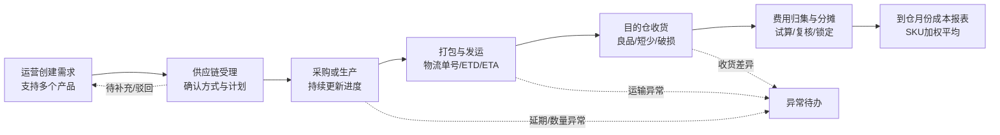
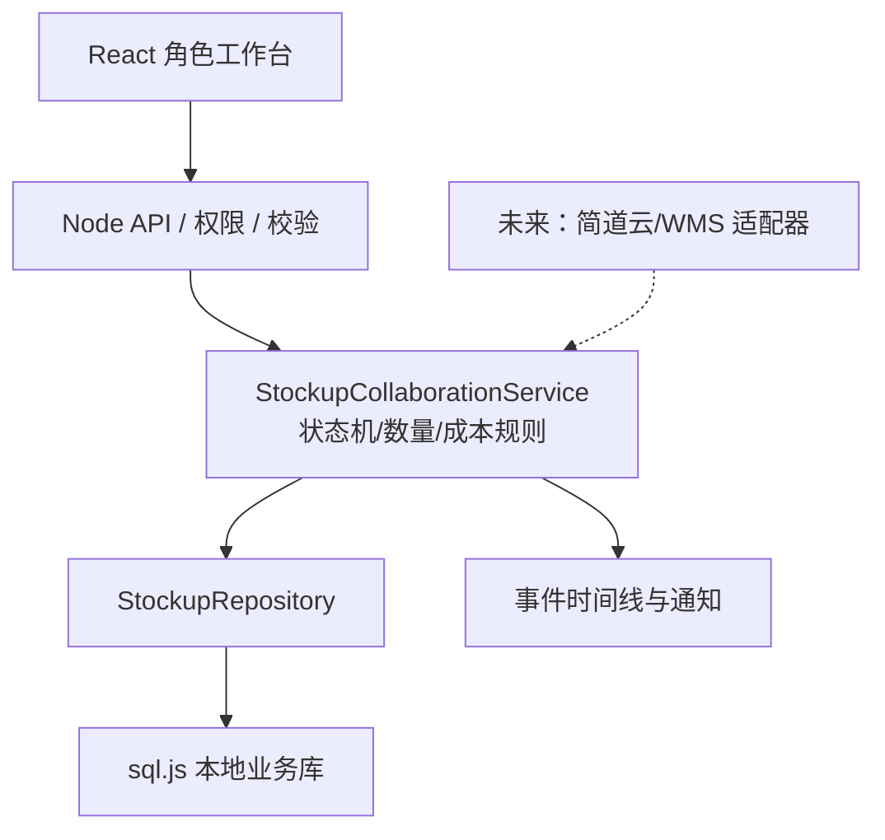

# 备货协同中心重构 Implementation Plan

> **For Claude:** REQUIRED SUB-SKILL: Use `executing-plans` to implement this plan task-by-task.

**Goal:** 将当前高学习成本的“备货执行”重构为一套从运营提需求、采购/生产执行、物流发运、仓库到货到费用结算与月度成本报表的完整网页端协同系统。

**Architecture:** 第一阶段不依赖简道云读写，使用现有 React + Node.js 单体架构和本地持久化仓储；前端按角色提供不同工作台，后端以统一需求单、行项目、执行任务、发运批次、收货批次和成本版本为核心，并通过事件时间线串联全过程。后续接入简道云时只新增数据适配层，不改变用户流程和核心 API。

**Tech Stack:** React 19、TypeScript、Vite 4、Node.js 16、原生 Node HTTP 服务、sql.js、本项目现有权限、操作日志与企业微信通知能力。

---

## 1. 文档状态与边界

- 状态：规划提案，待业务确认后开发。
- 本阶段只规划并开发网页端完整能力，不读写简道云备货表单。
- 不在第一版自动向 WMS 创建入库单；先保留到仓确认和 WMS 单号字段，为后续接口接入预留适配层。
- 备货建议仍可作为需求来源，但不能再决定主流程和页面结构。
- 系统以桌面端为主，兼顾常用平板尺寸。
- 所有金额统一保留人民币值，同时保留原币、汇率和原始金额。

## 2. 现状复盘

当前系统已经具备需求、执行、发运、费用分摊和到仓成本批次等基础能力，但页面与业务使用方式存在以下问题：

1. “建执行单、更新供应进度、发货与 WMS 确认、费用处理”集中在一个页面，角色边界不清。
2. 运营创建需求时一次只能录入一个产品，批量采购或生产需要重复填表。
3. 页面以系统对象和字段为中心，不是以用户下一步任务为中心，用户需要理解整条技术链路后才能操作。
4. 采购、生产、打包、发运、到仓缺少统一事件时间线，运营不能快速判断目前卡在哪里。
5. 发运记录已有承运商、物流单号和发货时间，但缺少预计到仓时间、实际到仓时间、物流节点和逾期提示。
6. 成本能力以单个发运批次为主，尚未形成按“实际到仓月份 + SKU + 国家/仓库”的月度加权成本报表。
7. 当前权限粒度主要是“查看/管理”，不适合运营、采购/生产、物流、仓库、成本人员分别操作。
8. 主流程依赖远端数据刷新时，页面容易出现等待和空白状态；第一阶段应使用本地业务库保证即时打开。

## 3. 方案选择

### 方案 A：按角色工作台 + 统一协同单（推荐）

运营只负责提需求和查看进度；供应链人员在待办队列中受理、拆分执行任务；物流维护发运；仓库确认到货；成本人员归集费用并锁定月度成本。所有角色围绕同一需求单和时间线协作。

优点：学习成本最低、职责明确、适合多产品和部分到货、便于权限切分与后续接入简道云/WMS。缺点：需要重构现有页面和部分数据模型。

### 方案 B：保留当前三步执行页并继续加字段

优点：开发改动较小。缺点：字段和操作会继续堆叠，运营仍要理解采购、物流、费用和 WMS，不能解决根本问题。

### 方案 C：只做看板拖动

优点：状态直观。缺点：多产品、部分到货、多个发运批次、费用凭证和成本版本很难在看板内准确表达，财务追溯能力不足。

**决策：采用方案 A。** 看板可作为供应链执行台的一种视图，但不作为唯一的数据录入方式。

## 4. 设计原则

1. **用户只处理自己的下一步。** 页面默认只展示与当前角色有关的待办和主操作。
2. **运营不学习供应链术语。** 运营只需要填写产品、数量、目的地、期望到仓时间和原因。
3. **一张需求单支持多个产品。** 系统内部可按采购/生产、供应商或发运批次拆分，运营无需重复建单。
4. **状态由明细自动汇总。** 总单状态不允许人工随意修改，避免总单和明细互相矛盾。
5. **每次变化都有时间线。** 记录谁、何时、做了什么、备注和附件，并向相关人回传。
6. **允许部分执行。** 部分下单、部分完工、分批发运、分月到货都必须自然支持。
7. **成本可追溯、可重算、不可静默覆盖。** 已锁定成本发生晚到费用时必须产生调整版本。
8. **默认少填、异常多填。** 正常流程减少输入；只有延期、短少、损坏、超预算等异常才要求补充原因。

## 5. 用户与职责

| 角色 | 主要任务 | 默认可见范围 |
|---|---|---|
| 运营 | 新建/编辑草稿、提交需求、查看自己或项目组进度、补充资料、撤回未受理需求 | 本人或授权项目组 |
| 采购/生产跟单 | 受理需求、拆分执行任务、登记采购/生产进度、预计完成时间、异常 | 授权国家、项目或供应链范围 |
| 物流跟单 | 打包、订舱/交运、物流单号、发运时间、预计到仓时间、运输节点 | 授权国家和仓库 |
| 仓库 | 确认实际到仓、良品/破损/短少数量、上架结果、上传凭证 | 当前账号绑定仓库 |
| 成本/财务 | 收集费用、汇率与凭证、试算、复核、锁定成本、处理调整 | 授权公司、项目、国家 |
| 管理员 | 全量查看、权限与字典配置、异常处理、解锁或版本调整 | 全部 |

第一版允许同一个账号同时承担多个角色，但页面仍按任务类型分区，不能回到“大表单包办所有操作”的模式。

## 6. 信息架构与菜单

现有“备货中心 / 备货建议 / 备货执行”调整为以下结构：

```text
备货协同
├─ 我的备货需求        运营默认入口
├─ 供应链执行台        采购、生产跟单默认入口
├─ 物流与到仓          物流、仓库默认入口
├─ 成本结算            成本/财务默认入口
├─ 月度成本报表        管理与财务入口
└─ 智能备货建议        原备货建议，作为需求来源
```

“备货协同”首页根据角色显示不同内容：

- 运营：草稿、待受理、进行中、即将到仓、异常/逾期。
- 采购/生产：待受理、待下单、执行中、待完工、异常。
- 物流：待打包、待发运、在途、即将到仓、逾期。
- 仓库：待收货、待确认差异、待上架。
- 成本：费用待收集、待复核、可锁定、晚到费用。

## 7. 主业务流程



### 7.1 运营提需求

一张需求单包含“公共信息 + 多个产品行”。

公共必填信息：

- 项目/团队
- 目的国家
- 目的仓库
- 期望到仓日期
- 优先级：常规、加急、紧急
- 需求原因：补库存、活动备货、新品首单、客户订单、其他

产品行必填信息：

- 产品（从产品库检索，自动带出图片、SKU、名称、规格和单位）
- 执行方式：采购、委外生产、自有库存调拨
- 需求数量

可选信息：目标成本、平台、销售计划、备注、附件。

交互要求：

- 支持连续添加多个产品、复制上一行和删除行。
- 相同 SKU、目的仓和执行方式重复时提示合并，不静默生成重复行。
- 支持保存草稿；草稿不进入供应链待办，也不发送通知。
- 提交前只展示缺少的必填项，不要求运营填写供应商、运输方式、分摊规则等执行字段。
- 提交后生成唯一需求单号，运营进入“我的备货需求”查看。

### 7.2 供应链受理与执行

供应链人员打开待办后，按产品行确认：

- 是否受理；不能受理时选择“待补充”或“驳回”并填写原因。
- 采购/生产/调拨方式。
- 计划数量、供应商或生产方、预计下单时间、预计完成时间。
- 是否拆分执行：同一产品可拆成多个采购/生产任务。

系统根据任务进度生成运营可理解的里程碑：

- 已受理
- 已采购/已下单
- 生产中
- 已完工/已到集货仓
- 打包中
- 已发运
- 已到目的仓

供应商名称属于敏感信息，运营视图默认只显示“供应方 A / 生产方 B”或不显示；有权限的供应链和管理员可查看真实名称。

### 7.3 打包、发运与在途

物流人员从“待发运”任务创建一个或多个发运批次。每个批次包含：

- 关联执行任务和本次发运数量
- 发货仓、目的仓
- 承运商、运输方式
- 物流单号/提单号
- 计划发运时间 ETD
- 实际发运时间
- 预计到仓时间 ETA
- 件数、毛重、体积、计费重（可选）
- 装箱单、发票、物流凭证等附件

运营视图只展示运输方式、物流单号、发运时间、预计到仓时间、当前节点和是否逾期。

### 7.4 到仓与验收

仓库按发运批次确认到货，支持分批收货。每个产品行记录：

- 应到数量
- 实收数量
- 良品数量
- 破损数量
- 短少数量
- 待确认数量
- 实际到仓时间
- 上架完成时间
- WMS 入库单号（第一版手工填，可选）
- 收货图片/视频/PDF 凭证和备注

数量不平时自动创建“收货差异”异常，不允许用修改发运数量的方式抹平差异。

### 7.5 费用归集与结算

费用不是到货后才开始录入。系统从采购/生产阶段就允许登记“预估费用”，到货后逐步替换为“实际费用”。费用分类如下：

| 阶段 | 费用类型 | 推荐分摊方式 |
|---|---|---|
| 货品 | 采购货款、生产加工费、包材 | 精确关联 SKU；否则按数量/金额 |
| 国内段 | 国内运费、提货费、集货费 | 重量、体积或数量 |
| 作业 | 打包人工、贴标、质检 | 数量或人工指定 |
| 头程 | 海运/空运/陆运/快递 | 计费重优先，其次重量/体积 |
| 清关 | 关税、清关费、保险 | 货值优先 |
| 海外仓 | 入库、上架、卸货 | 数量、重量或体积 |
| 调整 | 补收、退款、索赔、汇差 | 手工分摊并填写原因 |

费用记录必须保存：原币金额、币种、汇率、人民币金额、费用日期、供应商、单据号、附件、是否计入到仓成本、分摊方式和录入人。

成本结算状态：

```text
费用收集中 → 可试算 → 待复核 → 已锁定
                              └→ 发现晚到费用 → 调整版待复核 → 新版本已锁定
```

锁定前检查：

- 已有实际收货数量。
- 必填费用类别已确认“已录入”或“本批无此费用”。
- 所有计入成本的费用分摊总额与费用人民币金额一致。
- 缺少直营供货价/采购价的 SKU 已补录或经有权限人员确认。
- 收货差异已处理或标记由谁承担。

## 8. 状态模型

### 8.1 运营看到的总单状态

```text
草稿
待受理
待补充
已受理
采购/生产中
待发运
已发运
部分到仓
已到仓
成本核算中
已完成
已驳回
已取消
```

总单状态从产品行、执行任务、发运和收货状态自动计算。对于多产品需求，页面同时展示“已到仓 3/5 个产品”和总数量进度，避免一个未完成产品遮蔽其他产品进度。

### 8.2 内部执行明细状态

```text
待分派 → 待下单 → 已下单 → 生产/采购中 → 已完工 → 待集货
→ 已到集货仓 → 打包中 → 待发运 → 已发运 → 清关中
→ 待收货 → 部分收货 → 已收货 → 已上架
```

异常状态作为独立标记，不替换主状态：延期、数量异常、质量异常、运输异常、收货差异、费用异常。这样异常解除后无需猜测应恢复到哪个主状态。

### 8.3 取消与回退规则

- 待受理前，运营可直接撤回并编辑。
- 已受理但未下单，由供应链确认后取消。
- 已下单后不能删除，只能“终止剩余数量”，保留已发生数量和费用。
- 已发运后不能回退到未发运，只能作废错误批次并创建更正记录。
- 已锁定成本不能覆盖修改，只能创建调整版本。

## 9. 页面设计

### 9.1 我的备货需求

顶部只保留五个指标：草稿、待受理、进行中、即将到仓、异常/逾期。

列表默认按“需要我关注”排序，每条需求卡展示：

- 需求单号、创建时间、目的仓、期望到仓日
- 产品缩略图，超过 3 个显示“另有 N 个”
- 总进度和当前里程碑
- 最新更新时间、当前负责人
- 下一步提示，例如“供应链待受理”“预计 9 月 30 日到仓”“需要补充装箱规格”

主要操作仅有：新建需求、查看详情、补充资料、撤回/取消。

### 9.2 新建需求

采用单页两区布局，而不是多步向导：

```text
┌ 基本信息 ──────────────────────────────┐
│ 项目  目的国家  目的仓  期望到仓日  优先级 │
└───────────────────────────────────────┘
┌ 产品清单 ──────────────────────────────┐
│ 图片  SKU/名称  执行方式  数量  单位  备注 │
│ [+ 添加产品] [批量粘贴 SKU]              │
└───────────────────────────────────────┘
                 [保存草稿] [提交需求]
```

产品选择器支持按 SKU、中文名、外文名搜索，自动带入图片和单位。批量粘贴在第一版支持“SKU + 数量”，CSV 导入可作为第二阶段。

### 9.3 需求详情

详情页固定包含四块：

1. 顶部摘要：状态、总体进度、预计/实际到仓、异常数。
2. 产品清单：每行数量进度、当前节点和预计完成日。
3. 快递式时间线：提交、受理、下单、完工、打包、发运、到仓、成本完成。
4. 讨论与附件：按事件关联，不再散落在多个表单。

对于当前角色，只在底部展示一个最主要的下一步按钮，例如“受理需求”“更新生产进度”“登记发运”“确认到货”“开始成本核算”。

### 9.4 供应链执行台

默认使用待办列表，可切换看板。每条任务展示产品、数量、期望到仓日、剩余天数和下一步动作。

筛选项控制在：任务类型、负责人、状态、是否逾期、目的仓。高级筛选折叠，不占用主页面。

批量操作只开放低风险动作：分派负责人、设置预计日期、标记无异常。下单、完工、取消等业务动作必须逐单确认。

### 9.5 物流与到仓

分为三个选项卡：待打包/待发运、在途、待收货。以发运批次为主，不再让用户先从执行单下拉框中寻找。

在途列表突出 ETA 和逾期天数；到仓确认采用“应到/实到/良品/破损/短少”的行表格，并自动校验数量关系。

### 9.6 成本结算

以“发运/收货批次”为单位形成费用清单：

- 左侧：批次、产品、收货数量、费用完整度。
- 中间：费用分类和凭证。
- 右侧：分摊结果、单件成本、与预估/上批差异。

系统默认推荐分摊方式，用户只需确认；需要改为手工分摊时必须填写原因。

### 9.7 月度成本报表

支持按月份、国家、仓库、项目、品牌和 SKU 筛选，展示：

- 到仓数量、到仓批次数
- 平均货品成本
- 平均物流与其他分摊成本
- 月度加权到仓单价
- 上月成本、环比变化和变化原因
- 成本覆盖率、已锁定/待锁定数量
- 可展开查看构成批次与原始费用凭证

## 10. 时间线与进度回传

时间线事件结构：

```ts
type StockupProgressEvent = {
  id: string;
  requestId: string;
  lineId?: string;
  taskId?: string;
  shipmentId?: string;
  eventType: string;
  title: string;
  description?: string;
  occurredAt: string;
  actorId: string;
  actorName: string;
  visibility: "all" | "internal" | "cost_only";
  attachmentIds: string[];
};
```

自动产生事件的动作：提交、受理、待补充、驳回、下单、预计日期变化、完工、打包、发运、物流节点、到仓、收货差异、上架、费用齐套、成本锁定、取消和异常解除。

第一版进度回传包含：

- 页面内消息中心与未读红点。
- 我的需求列表实时读取本地业务库，不要求用户点击“同步全部数据”。
- 详情页最近事件置顶，并支持手动重新加载。
- 关键动作完成后立即使相关列表缓存失效。

企业微信通知作为紧随第一版后的增强项，复用现有项目组/用户路由：受理、驳回、延期、发运、到仓、异常和成本锁定时通知需求人及关注人。

## 11. 到仓成本口径

### 11.1 第一版采用“当月入库批次加权平均”

维度：`到仓月份 + 国家 + 仓库 + SKU + 人民币`。

```text
批次到仓总成本
= 实收合格品对应的采购/生产成本
+ 分摊到该 SKU 的国内段、作业、头程、清关、保险、海外仓及其他计入成本费用

SKU 当月加权到仓单价
= 当月所有已锁定收货批次的到仓总成本之和
/ 当月所有已锁定批次的成本计量数量之和
```

成本计量数量默认取“良品入库数量”。破损、短少和报废形成异常损失，不自动摊入良品；成本人员可按公司会计口径选择计入，并留下调整原因和审批记录。

### 11.2 跨月与部分到货

- 同一发运批次分两个月到仓时，按实际收货批次分别进入对应月份。
- 未实际到仓的数量不进入月度正式成本。
- 当月只有预估费用时可展示“预估成本”，但不能混入“已锁定正式成本”。
- 晚到费用进入原到仓月份的调整版本，并标记该月报表已重算；旧版本永久保留。

### 11.3 与库存移动加权成本的边界

第一版报表计算的是“当月新到仓货物的加权到仓成本”，不等同于库存会计中的移动加权成本。后续若要计算库存账面移动平均，应使用：

```text
(月初库存数量 × 月初单位成本 + 本月入库总成本)
/ (月初库存数量 + 本月入库数量)
```

两种口径必须在页面上分开命名，不能混在同一指标里。

## 12. 数据模型

第一阶段建议使用 sql.js 持久化为本地 SQLite 文件，沿用 Node.js 16，不增加独立数据库服务。

| 表 | 用途 | 关键字段 |
|---|---|---|
| `stockup_requests` | 需求单头 | request_no、project、destination、expected_arrival_at、status、requester、version |
| `stockup_request_lines` | 多产品需求行 | product_id、sku、method、requested_qty、fulfilled_qty、status |
| `stockup_execution_tasks` | 采购/生产/调拨任务 | line_id、assignee、supplier、planned_qty、ordered_qty、completed_qty、eta |
| `stockup_progress_events` | 不可变时间线 | entity_id、event_type、actor、occurred_at、visibility、payload |
| `stockup_shipments` | 发运批次 | shipment_no、carrier、tracking_no、etd、eta、actual_shipped_at、status |
| `stockup_shipment_lines` | 发运产品 | task_id、sku、shipped_qty、weight、volume、chargeable_weight |
| `stockup_receipts` | 收货批次 | shipment_id、warehouse、arrived_at、wms_inbound_no、status |
| `stockup_receipt_lines` | 收货明细 | expected、received、good、damaged、shortage、pending、shelved_qty |
| `stockup_cost_items` | 原始费用 | category、currency、exchange_rate、amount_cny、included、status、attachment |
| `stockup_cost_allocations` | 费用分摊 | cost_item_id、receipt_line_id、method、allocated_amount_cny |
| `stockup_cost_versions` | 批次成本版本 | receipt_id、version、type、status、locked_at、locked_by |
| `stockup_monthly_cost_snapshots` | 月度快照 | month、country、warehouse、sku、qty、total_cost、unit_cost、version |
| `stockup_attachments` | 文件元数据 | entity_type、entity_id、mime_type、path、uploader |
| `stockup_notifications` | 页面内通知 | recipient_id、event_id、read_at |

约束：

- 所有业务编号唯一。
- 数量和金额存储使用定点整数或明确精度，不直接依赖浮点相等比较。
- 每个可编辑聚合对象有 `version` 字段，用于乐观并发控制。
- 删除采用状态作废，不物理删除财务、发运和收货记录。
- 附件只保存文件路径和校验值，不把大文件写入数据库。

## 13. 服务与接口

### 13.1 分层



状态计算、数量校验和成本公式必须位于服务层，不能只在前端判断。

### 13.2 建议 API

需求：

- `GET /api/stockup/collaboration/requests`
- `POST /api/stockup/collaboration/requests`
- `GET /api/stockup/collaboration/requests/:id`
- `PATCH /api/stockup/collaboration/requests/:id`
- `POST /api/stockup/collaboration/requests/:id/submit`
- `POST /api/stockup/collaboration/requests/:id/accept`
- `POST /api/stockup/collaboration/requests/:id/request-changes`
- `POST /api/stockup/collaboration/requests/:id/reject`
- `POST /api/stockup/collaboration/requests/:id/cancel`
- `GET /api/stockup/collaboration/requests/:id/timeline`

执行：

- `GET /api/stockup/collaboration/tasks`
- `POST /api/stockup/collaboration/tasks`
- `PATCH /api/stockup/collaboration/tasks/:id`
- `POST /api/stockup/collaboration/tasks/:id/progress`
- `POST /api/stockup/collaboration/tasks/:id/terminate-remaining`

发运与收货：

- `GET/POST /api/stockup/collaboration/shipments`
- `PATCH /api/stockup/collaboration/shipments/:id`
- `POST /api/stockup/collaboration/shipments/:id/dispatch`
- `POST /api/stockup/collaboration/shipments/:id/logistics-events`
- `GET/POST /api/stockup/collaboration/receipts`
- `POST /api/stockup/collaboration/receipts/:id/confirm`

成本与报表：

- `GET/POST /api/stockup/collaboration/cost-items`
- `POST /api/stockup/collaboration/costs/preview`
- `POST /api/stockup/collaboration/costs/:receiptId/submit-review`
- `POST /api/stockup/collaboration/costs/:receiptId/lock`
- `POST /api/stockup/collaboration/costs/:receiptId/adjust`
- `GET /api/stockup/collaboration/reports/monthly-cost`
- `GET /api/stockup/collaboration/reports/monthly-cost/export`

通用要求：

- 写接口接收 `Idempotency-Key`，防止双击重复建单。
- 更新接口接收对象 `version`，版本冲突返回 HTTP 409 和最新数据。
- 列表全部服务端分页，默认 20 条，最大 100 条。
- API 返回用户可理解的错误码和中文提示，不把 HTML 或原始堆栈返回页面。

## 14. 权限拆分

新增细粒度权限，并保留旧权限迁移映射：

| 权限 | 能力 |
|---|---|
| `stockup_request_create` | 创建、编辑本人草稿并提交 |
| `stockup_request_view_own` | 查看本人/本人项目需求 |
| `stockup_request_view_all` | 查看授权数据范围内全部需求 |
| `stockup_request_accept` | 受理、待补充、驳回 |
| `stockup_execution_update` | 创建任务并更新采购/生产进度 |
| `stockup_shipment_update` | 打包、发运和物流节点 |
| `stockup_receipt_confirm` | 到仓与上架确认 |
| `stockup_cost_edit` | 费用录入和试算 |
| `stockup_cost_review` | 成本复核 |
| `stockup_cost_lock` | 锁定或创建调整版本 |
| `stockup_cost_report_view` | 查看月度成本报表 |
| `stockup_supplier_view` | 查看真实供应商名称 |

迁移建议：

- 原 `stockup_workflow_view` 映射到需求查看和协同首页。
- 原 `stockup_workflow_manage` 暂映射到需求受理、成本编辑，管理员再逐步回收多余权限。
- 原 `stockup_execution_view/manage` 映射到执行、发运和到仓相关权限。
- 页面菜单和 API 使用同一权限定义，避免“菜单看得到但接口无权限”或反向情况。
- 数据范围继续叠加国家、仓库、项目和账号绑定仓库限制。

## 15. 性能、可靠性与安全

- 页面先读取本地业务库；首屏不触发简道云、WMS 或其他远端全量同步。
- 首页和列表 P95 响应目标低于 500ms，详情低于 800ms（不含附件下载）。
- 数据库写入采用事务语义：业务状态、时间线、通知要么同时成功，要么全部回滚。
- 列表使用索引：状态、负责人、项目、仓库、预计到仓日、创建时间、SKU。
- 附件限制类型、单文件大小和总数量，生成不可执行的安全文件名。
- 真实供应商、成本和汇率按权限脱敏。
- 每次状态变化、金额修改、解锁和调整都进入操作日志。
- 每日备份本地业务库和附件索引；恢复流程需纳入上线验收。
- 构建与运行必须通过 Node.js 16 环境验证，不引入仅支持 Node 18+ 的依赖。

## 16. 关键异常与处理规则

| 场景 | 系统行为 |
|---|---|
| 重复点击提交 | 使用幂等键返回同一结果，不重复建单 |
| 两人同时修改 | 后提交者收到版本冲突和最新内容，不覆盖前者 |
| 部分产品完成 | 总单显示部分完成，继续保留未完成产品待办 |
| 实收大于发运 | 阻止保存或要求管理员确认异常来源 |
| 短少/破损 | 自动建异常，记录责任和成本处理方式 |
| ETA 已过未到仓 | 自动标记逾期，进入物流异常队列 |
| 费用不齐 | 允许预估试算，不允许锁定正式成本 |
| 费用晚到 | 创建调整版本，重算原到仓月份，保留旧版本 |
| 缺少产品成本 | 提示补录直营供货价/采购价，不以 0 元完成锁定 |
| 已发运后取消 | 终止未发部分，已发部分继续到仓和结算 |
| 外部接口不可用 | 第一版主流程不受影响；未来适配器失败只生成同步异常 |

## 17. 分阶段开发计划

### Task 1：建立本地协同数据层和状态机

**Files:**

- Create: `server/stockup-collaboration-db.js`
- Create: `server/stockup-collaboration-service.js`
- Create: `server/stockup-status-machine.js`
- Create: `scripts/stockup-collaboration-test.mjs`
- Modify: `package.json`

**Steps:**

1. 先写状态迁移、数量守恒、幂等和版本冲突测试，确认失败。
2. 使用 sql.js 创建上述业务表、索引、版本号和原子保存能力。
3. 实现需求单、行项目、任务、事件的仓储和事务服务。
4. 运行 `node scripts/stockup-collaboration-test.mjs`。
5. 运行 `npm run build`，确认 Node.js 16 兼容。

### Task 2：实现运营“我的备货需求”

**Files:**

- Create: `src/stockup/types.ts`
- Create: `src/stockup/status.ts`
- Create: `src/stockup/StockupCollaborationCenter.tsx`
- Create: `src/stockup/RequestCreatePanel.tsx`
- Create: `src/stockup/MyRequests.tsx`
- Create: `src/stockup/stockup-collaboration.css`
- Modify: `src/api.ts`
- Modify: `src/main.tsx`
- Modify: `server/server.js`

**Steps:**

1. 添加需求 CRUD、草稿、提交、撤回和分页 API 测试。
2. 实现多产品单页表单、产品选择器、重复 SKU 校验和草稿保存。
3. 实现“我的需求”指标、列表和详情摘要。
4. 将原备货入口以功能开关切换到新页面，保留旧页作为临时回退。
5. 验证运营无需填写供应商、运输和费用字段即可提交。

### Task 3：实现供应链受理和执行台

**Files:**

- Create: `src/stockup/ExecutionQueue.tsx`
- Create: `src/stockup/RequestDetailDrawer.tsx`
- Create: `src/stockup/ProgressTimeline.tsx`
- Modify: `server/stockup-collaboration-service.js`
- Modify: `server/server.js`
- Modify: `src/api.ts`

**Steps:**

1. 为受理、待补充、驳回、任务拆分、进度更新和终止剩余数量写测试。
2. 实现按角色返回待办和允许动作的服务端逻辑。
3. 实现列表/看板视图和“唯一下一步主按钮”。
4. 实现不可变事件时间线和供应商字段脱敏。
5. 验证多产品、部分下单、部分完成和跨负责人场景。

### Task 4：实现物流发运与到仓验收

**Files:**

- Create: `src/stockup/ShipmentWorkspace.tsx`
- Create: `src/stockup/ReceiptWorkspace.tsx`
- Create: `scripts/stockup-shipment-receipt-test.mjs`
- Modify: `server/stockup-collaboration-service.js`
- Modify: `server/server.js`
- Modify: `src/api.ts`

**Steps:**

1. 编写分批发运、分批收货、跨月到货和数量差异测试。
2. 实现 ETD、ETA、物流单号、事件和逾期计算。
3. 实现应到/实到/良品/破损/短少/待处理的守恒校验。
4. 支持收货凭证上传与异常自动创建。
5. 保留 WMS 入库单号和未来适配接口，但不调用简道云/WMS。

### Task 5：实现费用归集和成本版本

**Files:**

- Create: `server/stockup-costing-service.js`
- Create: `src/stockup/CostSettlementWorkspace.tsx`
- Create: `scripts/stockup-costing-test.mjs`
- Modify: `server/server.js`
- Modify: `src/api.ts`

**Steps:**

1. 对数量、重量、体积、货值和手工分摊分别写精度测试。
2. 实现费用类别、原币/汇率、附件、计入成本标记和分摊记录。
3. 实现费用完整度检查、预估试算、提交复核和锁定。
4. 实现晚到费用调整版，确保旧版本不可覆盖。
5. 对总费用与分摊合计做分币级校验。

### Task 6：实现月度成本报表

**Files:**

- Create: `src/stockup/MonthlyCostReport.tsx`
- Create: `scripts/stockup-monthly-cost-test.mjs`
- Modify: `server/stockup-costing-service.js`
- Modify: `server/server.js`
- Modify: `src/api.ts`

**Steps:**

1. 编写同月多批次、跨月部分到货、0 数量、破损和调整版测试。
2. 按到仓月份、国家、仓库和 SKU 生成版本化月度快照。
3. 实现筛选、展开成本构成、环比和覆盖率。
4. 实现 CSV 导出并保留 SKU 前导零和金额精度。
5. 明确区分“月度到仓加权成本”和未来“库存移动加权成本”。

### Task 7：权限、通知与审计

**Files:**

- Modify: `server/access-control.js`
- Modify: `server/server.js`
- Modify: `server/agent-index.js`
- Modify: `src/main.tsx`
- Modify: `scripts/access-control-test.mjs`
- Create: `scripts/stockup-notification-test.mjs`

**Steps:**

1. 新增细粒度权限和旧权限迁移映射。
2. 菜单、页面按钮和 API 同时应用权限与数据范围。
3. 实现页面内通知、未读状态和项目组/关注人路由。
4. 将关键动作写入操作日志。
5. 验证运营、采购、物流、仓库、成本、管理员六类账号。

### Task 8：迁移、性能与生产验收

**Files:**

- Create: `scripts/stockup-collaboration-migration.mjs`
- Create: `scripts/stockup-collaboration-performance.mjs`
- Modify: `scripts/smoke-api.mjs`
- Modify: `README.md`

**Steps:**

1. 将现有网页端可用的备货需求/执行/发运数据只读迁移到新结构；不触发简道云写入。
2. 增加功能开关，管理员可临时切回旧页面查看历史数据。
3. 用 10,000 个需求行、2,000 个发运批次和 20,000 条费用记录做分页与报表性能测试。
4. 在 Node.js 16 环境运行构建、全部新增测试和关键回归测试。
5. 先上线给少量运营和供应链账号试用，确认一周后再替换旧入口。

## 18. 测试矩阵

### 业务流程

- 单产品采购完整闭环。
- 多产品同时包含采购和生产。
- 一张需求拆为多个执行任务。
- 一个任务分多次发运。
- 一个发运批次分多次、跨月份到仓。
- 部分完成、终止剩余数量和收货差异。
- 加急需求、延期、物流异常和费用晚到。

### 权限

- 运营只能编辑本人草稿，不能修改已受理执行数据。
- 供应链可以处理授权范围任务，但默认看不到无关项目。
- 仓库账号只能确认绑定仓库的收货。
- 无成本权限人员看不到采购价、费用和月度成本。
- API 越权与菜单隐藏结果一致。

### 成本

- 各分摊方式合计准确，尾差落到金额最大的明细并可追溯。
- 缺成本、缺汇率、0 数量和负调整都有明确结果。
- 锁定后原版本不可修改。
- 月度报表只统计实际到仓且已锁定的批次。
- 调整版本能重算原月份且保留历史版本。

### 性能与可靠性

- 页面打开不调用简道云或 WMS 全量接口。
- 10,000 行数据仍使用服务端分页，浏览器不持有全量记录。
- 连续双击、断网重试不会重复建单或重复记费。
- 并发修改不丢数据。
- 数据库与附件备份可恢复。

## 19. 第一版验收标准

1. 运营可在一个页面提交包含多个产品的需求，必填字段不超过业务必要范围。
2. 运营可在“我的备货需求”看到每张单当前节点、预计到仓时间、最新进度和异常。
3. 供应链可受理、拆分采购/生产任务，并持续回传下单、完工和打包进度。
4. 物流可登记多个发运批次、物流单号、ETD、ETA 和在途节点。
5. 仓库可分批确认到仓、良品、破损、短少和上架结果。
6. 成本人员可收集费用凭证、选择分摊规则、试算、复核和锁定成本版本。
7. 系统可按实际到仓月份生成 SKU 月度加权到仓成本报表并导出 CSV。
8. 全过程有时间线、操作日志、角色权限和数据范围控制。
9. 页面不依赖简道云读取即可完成第一版闭环，且 Node.js 16 可构建运行。
10. 旧页面保留临时回退开关，试运行确认后再移除。

## 20. 默认业务决策（确认时重点检查）

以下默认项不会阻碍第一版开发，但建议业务方确认：

1. 一张需求单可同时包含采购和生产产品，系统内部拆任务，不要求运营分开提交。
2. 期望到仓日期设在需求单头；若单个产品日期不同，可在产品行覆盖。
3. 月度成本第一版使用“实际到仓月份的已锁定批次加权平均”，不做库存移动平均。
4. 成本计量数量默认使用良品入库数量，破损与短少进入异常损失。
5. 运营默认看不到真实供应商和详细采购成本，只能看进度；成本权限单独授予。
6. 第一版使用页面内通知；企业微信提醒作为紧接第一版的增强，不影响主流程上线。
7. 第一版不调用简道云和 WMS 写接口，但保留外部单号和适配器位置。

## 21. 预期效果

- 运营从“理解整条供应链”变为“填一个简单需求单、看快递式进度”。
- 供应链从“在长页面找字段”变为“只处理自己的下一步待办”。
- 管理层可以定位延期发生在采购、生产、打包、物流还是收货。
- 财务不再事后到处收集费用，系统以批次清单驱动费用齐套。
- 每月 SKU 到仓成本有统一公式、凭证、版本和追溯链，能够用于经营分析和后续成本回写。
